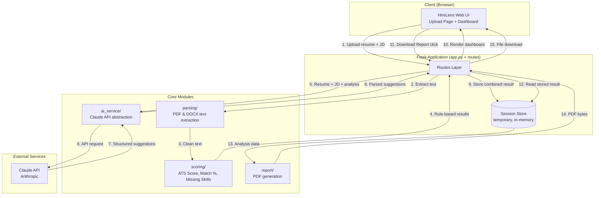
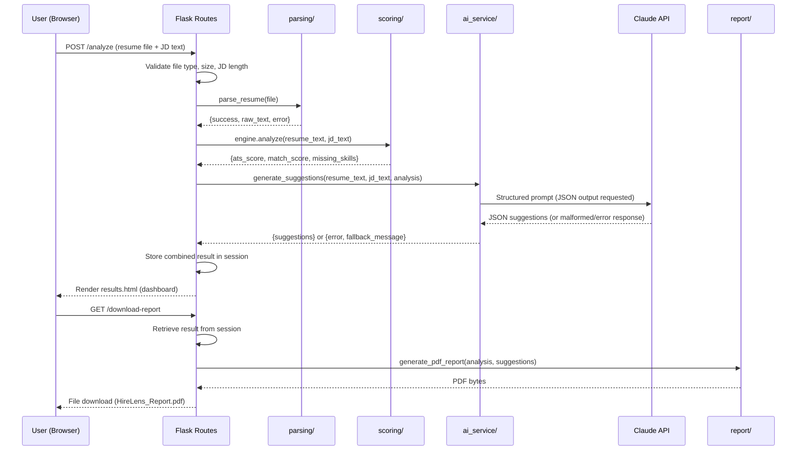

# HireLens — System Architecture

**Companion to:** PRD, Implementation Blueprint
**Status:** Finalized Day 2 — source of truth for all remaining implementation days.

---

## 1. Final Tech Stack

| Layer | Choice | Why |
|---|---|---|
| **Backend Framework** | Python + Flask | Matches Ansh's existing skill set (fastest path to quality output in 10 days), lightweight, no unnecessary boilerplate, excellent for a single-workflow app, huge free documentation/community support. |
| **Resume Parsing** | `pdfplumber` (PDF), `python-docx` (DOCX) | Both are free, actively maintained, pure-Python-friendly (no complex system dependencies), and well-suited to text-based resume extraction — matching the PRD's top identified risk area. |
| **Rule-Based Scoring** | Custom Python logic + regex/keyword matching (no external ML library required) | Keeps the core scoring fast, free, deterministic, and dependency-light — directly satisfies the PRD's reliability requirement (core scoring must never depend on external services). |
| **AI Layer** | Claude API via the official `anthropic` Python SDK | Real generative AI for personalized suggestions, called through an isolated `ai_service` abstraction so the provider can be swapped later without touching the rest of the app (per PRD FR-7). |
| **AI Model** | `claude-sonnet-5` (recommended) | Strong balance of reasoning quality and cost for structured, personalized suggestion generation. If API costs become a concern during testing, `claude-haiku-4-5-20251001` is a cheaper, faster fallback with slightly less nuanced output — this can be swapped via one config value, no code changes. |
| **PDF Report Generation** | `reportlab` | Pure Python, installs via `pip` with **no system-level dependencies** (unlike alternatives such as WeasyPrint, which require external libraries like Pango/GTK). This directly protects the PRD's #1 deployment risk: "the application should work the same in production as it does locally." Trade-off: slightly more verbose layout code than an HTML/CSS-based approach, but far more deployment-reliable. |
| **Database** | **None (no persistent database in v1.0)** | Per PRD scope, HireLens is a stateless, single-session tool — no accounts, no saved history. Analysis results only need to persist briefly between the "Analyze" and "Download Report" steps within one browser session. See `SCHEMA.md` for how this is handled. |
| **Authentication** | **None (explicitly out of scope for v1.0)** | Confirmed non-goal per PRD Section 5.2. |
| **Frontend** | Server-rendered HTML via Jinja2 templates + vanilla CSS + vanilla JS | No frontend framework needed for a single-workflow app; keeps the build fast and avoids unnecessary build tooling (no npm/bundler required), consistent with Ansh's prior project pattern of dependency-light, fast-to-ship apps. |
| **Hosting/Deployment** | **Render** (free tier, Web Service) | Free tier supports Python/Flask natively, deploys directly from GitHub, supports environment variables via dashboard (secure secret management), no credit card required for the free tier at time of writing. Alternative considered: Railway (also viable; Render chosen for slightly simpler free-tier Flask deployment docs). Final platform login/setup guided step-by-step on Day 10. |
| **Version Control** | Git + GitHub | Already set up (Day 2, Part A–D). |
| **Secrets Management** | `python-dotenv` locally, Render's Environment Variables dashboard in production | Ensures `ANTHROPIC_API_KEY` is never hardcoded or committed. |

**No paid tools are required anywhere in this stack.** All libraries are open-source/free; hosting uses Render's free tier; the only recurring cost is Claude API usage, billed per request at low volume (a handful of test/demo calls per day during the capstone).

---

## 2. Component Diagram

---

## 3. Data Flow (End-to-End)

---

## 4. Request Lifecycle (Detailed)

1. **User lands on `/`** → Flask renders `index.html` (upload form: resume file input + JD textarea).
2. **User submits the form** → `POST /analyze`.
3. **Flask validates input:**
   - File present, extension is `.pdf`/`.docx`, size ≤ 5MB.
   - JD text present and ≥ 100 characters.
   - On failure → re-render `index.html` with an inline error message (no page redirect, preserves form state where possible).
4. **Resume parsing (`parsing/`)** extracts raw text. On failure (e.g., scanned PDF with no extractable text) → return a clear error, do not proceed further.
5. **Rule-based scoring (`scoring/`)** runs synchronously (fast, no I/O wait): ATS score, match %, missing skills, keyword analysis.
6. **AI suggestions (`ai_service/`)** call the Claude API with a structured prompt containing resume text, JD text, and the rule-based analysis summary as grounding context. This step has the highest latency (a few seconds).
7. **Result assembly:** Flask combines parsing metadata, scoring results, and AI suggestions (or fallback message if AI failed) into a single result dictionary.
8. **Result storage:** the combined result is stored server-side, keyed to the user's Flask session (see `SCHEMA.md` for the exact structure) — **not** in a database, since it only needs to survive until the report download or session end.
9. **Dashboard render:** Flask renders `results.html` using the stored result.
10. **Report download:** `GET /download-report` reads the same session-stored result (no re-analysis, no duplicate API calls) and passes it to `report/pdf_generator.py`, which returns a PDF file as an attachment.

---

## 5. AI Interaction Detail

- **Trigger point:** Only after rule-based scoring completes successfully — AI suggestions are **enrichment**, never a blocker for the core score results.
- **Input to Claude API:** Raw resume text, raw JD text, and the rule-based analysis summary (ATS score breakdown, match %, missing skills list) — giving the model concrete, real gaps to address instead of generating generic advice.
- **Prompt contract:** The model is instructed to return **only** a JSON object matching a fixed schema (see PRD FR-7 / Blueprint Day 6). No conversational text, no markdown fences requested — though the parser defensively strips these if the model adds them anyway.
- **Failure handling:** Any failure (timeout, auth error, malformed JSON, rate limit) is caught in `ai_service/`, logged server-side, and surfaced to the user as a clear, friendly fallback message (e.g., "AI suggestions are temporarily unavailable — your ATS score and match analysis below are unaffected"). The rest of the dashboard and the PDF report still render normally.
- **No conversation memory:** Each analysis is a single, independent API call — there is no multi-turn chat state to manage, keeping this layer simple and stateless.

---

## 6. External Services

| Service | Purpose | Failure Impact |
|---|---|---|
| **Claude API (Anthropic)** | Generates personalized resume improvement suggestions | Core scoring (ATS score, match %, missing skills) continues to work normally; only the AI suggestions section shows a fallback message. |
| **Render (hosting)** | Serves the deployed application publicly | N/A at design time — covered operationally in Day 10. |
| **GitHub** | Source control + deployment trigger (Render deploys from the connected GitHub repo) | N/A at design time. |

No other third-party services (no analytics, no payment processors, no external databases) are used in v1.0 — consistent with the PRD's minimal-dependency, reliability-first approach.

---

## 7. Why No Database (Explicit Justification)

The PRD explicitly excludes accounts, saved history, and multi-session persistence from v1.0. The only "data storage" need is passing one analysis result from the `/analyze` step to the `/download-report` step within the *same browser session*. This is handled via:

- **Flask session** (signed cookie referencing server-side session data) if the result is small enough, **or**
- **A short-lived server-side in-memory cache keyed by a generated request ID**, if the full analysis payload (including AI suggestions) is too large for a cookie-based session comfortably.

This decision will be finalized with a concrete size check on Day 8 (per the Blueprint), but **no database — SQL or NoSQL — is required for v1.0** under any implementation of this approach. See `SCHEMA.md` for the exact data structure either way.

---

*End of ARCHITECTURE.md*
