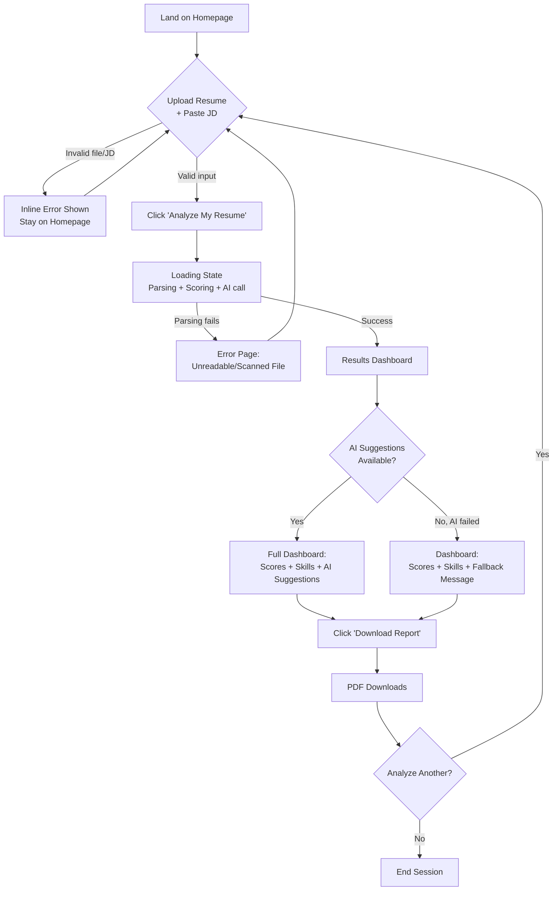
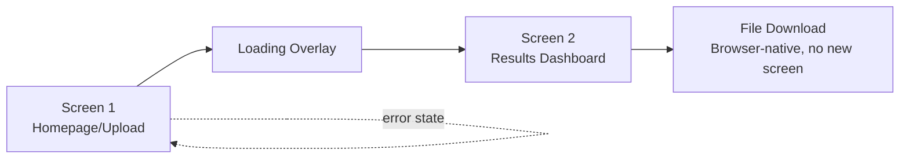

# HireLens — UI & User Flow

**Companion to:** API.md, ARCHITECTURE.md
**Status:** Finalized Day 2 — low-fidelity wireframes only; visual design/CSS happens Day 7 per Blueprint.

---

## 1. User Flow Diagram



---

## 2. Screen Inventory

Every screen exists to serve exactly one step of the core PRD workflow — no extra screens.

| Screen | Purpose | Route |
|---|---|---|
| **Homepage / Upload** | Entry point — collect resume + JD | `GET /` |
| **Loading State** | Reassure user during the (few-second) analysis + AI call | (client-side overlay, no separate route) |
| **Results Dashboard** | Present all analysis output | Rendered by `POST /analyze` |
| **Error State** (inline) | Communicate validation/parsing failures without losing context | Rendered within Homepage template |

**Only 3 real screens.** This is intentional — matches the PRD's single, focused workflow and avoids UI scope creep.

---

## 3. Screen Flow (Sequence)



---

## 4. Wireframe — Screen 1: Homepage / Upload

```
┌──────────────────────────────────────────────────────────┐
│  HireLens                                                 │
│  See your resume the way an ATS — and a recruiter — see it│
├──────────────────────────────────────────────────────────┤
│                                                            │
│   ┌────────────────────────────────────────────────┐     │
│   │   📄  Drag & drop your resume here               │     │
│   │        or click to browse                        │     │
│   │        (PDF or DOCX, max 5MB)                     │     │
│   └────────────────────────────────────────────────┘     │
│                                                            │
│   Paste the job description below:                        │
│   ┌────────────────────────────────────────────────┐     │
│   │                                                  │     │
│   │  [ large textarea ]                              │     │
│   │                                                  │     │
│   └────────────────────────────────────────────────┘     │
│                                                            │
│              [   Analyze My Resume   ]                    │
│                                                            │
│   ⚠ (inline error message appears here if validation      │
│      fails — file type, size, or JD length)                │
│                                                            │
└──────────────────────────────────────────────────────────┘
```

**Notes:**
- Single-column layout at all widths (mobile-first — this screen never needs multi-column).
- The CTA button is disabled/greyed out until both a valid file and JD text are present (client-side check, refined Day 7).

---

## 5. Wireframe — Loading State (Overlay)

```
┌──────────────────────────────────────────────────────────┐
│                                                            │
│                                                            │
│                    ⟳  Analyzing your resume...             │
│                                                            │
│           Checking ATS compatibility, comparing            │
│           against the job description, and generating      │
│           personalized suggestions.                        │
│                                                            │
│                                                            │
└──────────────────────────────────────────────────────────┘
```

**Notes:** Appears immediately on form submit (before the server responds) to avoid a "frozen" feeling during the AI call latency — implemented Day 7.

---

## 6. Wireframe — Screen 2: Results Dashboard (Desktop, wide layout)

```
┌──────────────────────────────────────────────────────────┐
│  HireLens                              [ Analyze Another ]│
├──────────────────────────────────────────────────────────┤
│                                                            │
│  ┌────────────────────┐   ┌────────────────────┐          │
│  │   ATS Score          │  │   Match %            │        │
│  │      78 / 100        │  │      64%             │        │
│  │  ● formatting ok      │  │  ● 12/18 keywords     │        │
│  └────────────────────┘   └────────────────────┘          │
│                                                            │
│  ── Missing Skills ──────────────────────────────────────  │
│  Programming: [ SQL ]  [ Java ]                            │
│  Tools: [ Docker ]  [ Power BI ]                            │
│  Soft Skills: [ Stakeholder Communication ]                 │
│                                                            │
│  ── Keyword Analysis ────────────────────────────────────  │
│  ✅ Matched: Python, Flask, Git, Excel, Data Analysis ...   │
│  ❌ Missing: SQL, Docker, Java ...                          │
│                                                            │
│  ── AI-Powered Suggestions ──────────────────────────────  │
│  Overall Feedback:                                         │
│  "Your resume shows strong data analysis experience..."     │
│                                                            │
│  Strengths:                                                 │
│  • Clear project descriptions                              │
│  • Quantified impact in 2 of 3 roles                        │
│                                                            │
│  Priority Improvements:                                     │
│  1. Add SQL — Suggestion: "..." Example: "..."               │
│  2. Highlight stakeholder communication — ...                │
│                                                            │
│  ── (or, if AI unavailable) ─────────────────────────────  │
│  ⚠ AI suggestions are temporarily unavailable.               │
│  Your ATS score and match analysis above are unaffected.     │
│                                                            │
│              [   Download Report (PDF)   ]                 │
│                                                            │
└──────────────────────────────────────────────────────────┘
```

**Notes:**
- Score cards use large numbers + simple color coding (red/yellow/green ranges) — actual visual styling done Day 7.
- Missing skills shown as "chip" tags grouped by category (matches `SCHEMA.md`'s `missing_by_category` structure directly — no data transformation needed between backend and UI).

---

## 7. Wireframe — Screen 2: Results Dashboard (Mobile, narrow layout)

```
┌──────────────────────┐
│ HireLens              │
│ [Analyze Another]     │
├──────────────────────┤
│  ATS Score            │
│    78 / 100           │
├──────────────────────┤
│  Match %               │
│    64%                 │
├──────────────────────┤
│  Missing Skills        │
│  [SQL] [Java] [Docker] │
├──────────────────────┤
│  Keyword Analysis      │
│  ✅ Matched: ...        │
│  ❌ Missing: ...        │
├──────────────────────┤
│  AI Suggestions         │
│  Overall Feedback: ...  │
│  Strengths: ...         │
│  Improvements: ...       │
├──────────────────────┤
│ [Download Report (PDF)] │
└──────────────────────┘
```

**Notes:** All sections stack vertically in a single column below ~768px width — no horizontal scrolling, no hidden/collapsed content (everything the desktop view shows, the mobile view shows too, just re-ordered vertically).

---

## 8. Navigation

- **No navigation menu / no multi-page site structure** — HireLens is intentionally a single linear flow, not a multi-section app. This is a deliberate simplicity choice matching the PRD's no-accounts, single-workflow scope.
- **"Analyze Another"** button on the Results Dashboard returns the user to the Homepage (`GET /`), clearing the current session's analysis so a fresh one can begin.
- **Browser back button** from the Results Dashboard returns to the Homepage naturally (standard browser behavior, no custom handling needed).

---

## 9. Screen-Purpose Justification (per Day 2 instruction: "every screen should exist for a reason")

| Screen | Why It Exists |
|---|---|
| Homepage/Upload | Required to collect the two inputs (resume + JD) the entire product depends on — PRD FR-1, FR-2 |
| Loading Overlay | Required because the AI call has real, noticeable latency (PRD NFR: Usability) — prevents a "broken" feeling |
| Results Dashboard | Required to present every PRD-mandated output (FR-3 through FR-9) in one place |
| Inline Error States | Required for PRD's usability requirement — non-technical users must understand failures without instructions |

No screen exists "because it might look nice" — every one traces directly back to a PRD requirement.

---

*End of UI-WIREFRAMES.md*
